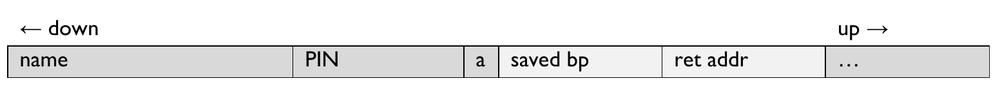
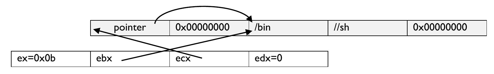

# Lab 2: Buffer Overflows

## Material

[Vagrantfile](../vagrants/lab2/Vagrantfile)

[stack.c](../vagrants/lab2/stack.c)

[test.c](../vagrants/lab2/test.c)

## Instructions

Background: buffer overflows and shellcode
--------------------------------------------

A buffer is a location in memory holding some data.
Suppose we have function with the following local variables:

```C
void foo() {
  char name[9]; // 8 bytes plus 0-terminator
  char PIN[5]; // 4 bytes plus 0-terminator
  char a = 1; // set to 0 if name/password correct
  // ...
}
```

Local variables live on the stack, and they might be allocated as follows (the stack grows downwards):



If we enter a PIN of `11111`, the result could be that the PIN buffer contains the hex value `31 31 31 31 31` (0x31 = ASCII "1"), but the following zero-terminator gets written to the next memory location ... which is the `a` variable, so it gets set to zero.
We've overwritten something beyond the buffer: a buffer overflow!

So far, we can mess with local variables.
What about code? Beyond the local buffers and any other space needed by the function lies the saved return address.
If we can overwrite this, we can make the program jump to a point of our choice.
If our buffer overflow is long enough and we know where the buffer is in memory, we can include some (compiled) code in it, and overwrite the return address to point to the compiled code in the buffer itself.
The result is that the program executes code of our choice, with its original permissions, i.e. if it's a setuid-root program, then we get our code executed with root rights.

We can make this attack even more powerful by having our compiled code execute a shell.
This gives us a shell with root rights (if the program was running setuid-root) from which we can do ... anything.
Such code is called _shellcode_.

Background: debugging with GDB
--------------------------------

GDB is the standard debugger on linux and part of the GNU Compiler Collection.
If you compile your program with the `-g` option to `gcc`, the source code and line numbers are available from within `gdb`.
When you do `gdb <program>`, you can use the following commands at its prompt.

| Command                              | Meaning                                                                                                                                                                                                                                                  |
| ------------------------------------ | -------------------------------------------------------------------------------------------------------------------------------------------------------------------------------------------------------------------------------------------------------- |
| `r`                                  | (re)run the program                                                                                                                                                                                                                                      |
| `q`                                  | quit gdb                                                                                                                                                                                                                                                 |
| `break <n>`                          | breakpoint at line `n`                                                                                                                                                                                                                                   |
| `break *<n>`                         | breakpoint at memory address `n`                                                                                                                                                                                                                         |
| `c`                                  | continue past breakpoint                                                                                                                                                                                                                                 |
| `s [n]`                              | step `n`lines in the source                                                                                                                                                                                                                              |
| `si [n]`                             | step `n`machine instructions                                                                                                                                                                                                                             |
| `n [n]`                              | step `n`lines in the source of the current function, executing any function calls on the way                                                                                                                                                             |
| `ni [n]`                             | step `n`machine instructions in the current function, executing any function calls on the way                                                                                                                                                            |
| `info registers`                     | display current register values                                                                                                                                                                                                                          |
| `disassemble/mr <function>`          | disassemble a function (among other things you can then work out the exact layout of its stack frame)                                                                                                                                                    |
| `x/<n><t>[s] m` (e.g. `x/20xb $esp`) | dump memory: `n` = number of items to show, `t` = type (`x`=hex,`d`/`u`=signed/unsigned int, `c`=char, `a`=address, `s`=string), `s`=size (`b`=byte, `h`=halfword (2 bytes), `w`=word), `m` = memory location, or register pointing to a memory location |
| `print <expression>`                 | print the value of something                                                                                                                                                                                                                             |
| `display <expression>`               | print something every time you hit a breakpoint or step                                                                                                                                                                                                  |
| `l [n]`                              | (this is a lowercase L) list `n` lines of code, default 10                                                                                                                                                                                               |

Task 1: Attack
---------------

Before we begin, we have to turn off some protection mechanisms that aim to prevent or mitigate buffer overflows.
We will look at these in detail in following tasks.

- **ASLR** (address space layout randomisation). Type the following shell command:
    ```bash
    $ sudo sysctl -w kernel.randomize_va_space=0
    ```
- **Stack guard**. To deactivate this, we need to pass the `-fno-stack-protector` option to `gcc` when we compile our program.
- **Non-executable stack**. To deactivate this, we need to pass the `-z execstack` option to `gcc` when we compile our program.

Compile the `stack.c` program from this lab's folder with:

```bash
$ gcc -g -z execstack -fno-stack-protector stack.c -o stack
$ cp stack stack-root
$ sudo chown root stack-root
$ sudo chmod 4755 stack-root
```

Have a look at the source code.
The program is set to read a file `badfile` (this use of a file means we don't have to worry as much about control characters like in the last lab) and copies it into a buffer.
But while the `fread` command is limited to 517 bytes, line 14:

```C
strcpy(buffer, str);
```

... runs until it sees a `0x00` byte, yet copies into a buffer that is only 24 bytes long.
This is an obvious overflow vulnerability.

Make a file called `shellcode` and paste the following values:

```
31 c0 50 68 2f 2f 73 68
68 2f 62 69 6e 89 e3 50
53 89 e1 99 b0 0b cd 80
```

Then run `xxd -p -r shellcode > badfile` to hex-decode it to the file that the vulnerable program will read.
Whenever you modify your shellcode, rerun this command.

Let's take a look at what it does:

```
31 c0 xorl %eax, %eax ; clear eax
50 pushl %eax ; put a 0-pointer on the stack
68 2f 2f 73 68 pushl "//sh" ; the command to call
68 2f 62 69 6e pushl "/bin"
89 e3 movl %esp, %ebx ; ebx points at the command
50 pushl %eax ; another 0-pointer
53 pushl %ebx ; points at the command
89 e1 movl %esp, %ecx ; pointer to pointer to command
99 cdq ; this zeroes out edx
b0 0b movb $0x0b, %al ; execve syscall number
cd 80 int $0x80 ; syscall
```

We store `/bin//sh` with an extra `/` (that `execve` doesn't mind) since the `0x68` (`pushl`) instruction takes a 4-byte argument, and we don't want to include an `0x00` byte in our shellcode.
When we call `int 0x80`, the stack and registers look like this:



We can test whether our shellcode works by setting up a program that calls it explicitly.
Use `test.c` from this lab's directory and compile it as follows:

```bash
$ gcc -z execstack -fno-stack-protector test.c -o test
```

It reads the file called `badfile` into a buffer and then executes this buffer with the following marvel of C syntax:

```C
((void(*)())b)();
```

If your compiled shellcode is correct, it will execute `/bin/sh` for you.

The task you are now faced with is getting your shellcode to be called from within stack-root by exploiting the buffer overflow.

**Task 1**: Modify your shellcode so that you get a root shell from calling stack-root.

Hints for Task 1:

- Debug the non-root version by calling `gdb stack`.
Set a breakpoint in `bof()` just after the `strcpy` and look at the stack frame: with ASLR off, what is the location of the return address? What is its offset of the return address from the start of the buffer?

- There may be a slight difference in the stack addresses between a program run normally, in a debugger and setuid root.
You can either experiment to find this offset (create a program that prints out the address of something on the stack and run it once in the debugger, once without) or you can use the next hint.

- If you can't get the exact address of your shellcode, you can use a NOP sled: a sequence of NOP (`0x90`) bytes before your actual shellcode starts, as long as possible.
As long as you manage to jump to anywhere within the NOP sled, your program will "slide" down to the shellcode at the end and execute it.

Task 2: Defences
------------------

In this task we will consider the effect of the three defences that we turned off for Task 1.

### 2.1 ASLR (address space layout randomisation)

Type the command:

```bash
$ sudo sysctl -w kernel.randomize_va_space=2
```

... to re-enable ASLR.
Run the stack program several times in GDB and note the different addresses of the buffer.
You have to quit and restart GDB between runs to get this to work: within a single instance of the `gdb` process you will always see the same addresses even if you rerun the program being debugged.

**Task**:

- Describe how ASLR makes the attack in Task 1 harder.
- What kind of defence (eliminate, reduce, control, mitigate / prevent, detect, recover) is this against buffer overflows, and how effective is it?
- What can render ASLR completely useless?

### 2.2 Stack Guard

Turn ASLR off again before you attempt this task.

**Task**:

- Recompile the program without the ` -fno-stack-protector` option. What happens when you try your attack now?
- Recompile again leaving off the `-g` option too. What happens now?
- In your coursework (technical part), explain how stack guard works and what kind of defence (see Task 2.1, point 2) it is.
- When is stack guard not effective at stopping buffer overflows?

### 2.3 Non-executable stack

Recompile the program with stack guard off again (and keep ASLR off), but use the option
`-z noexecstack` this time.

**Task**:

- Describe what happens when you run your attack this time.
- What kind of defence is this?

Extra questions
---------------

If you have completed all of Tasks 1 and 2, you may want to try the following.

### Real and Effective UIDs

Although Task 1 gets you a root shell, it only has an *effective uid* of 0 (`root`) but the *real uid* is still that of the original user (`seed`); this is how setuid programs work.

```bash
$ id
uid=1000(seed) euid=0(root)...
```

Some programs, in particular shells, behave differently if they are run with full root privileges (uid=euid=0) than with only an effective uid of 0.
The kernel's access checks however are based on the effective uid so you can already do most things that root can do.

From a program with an effective uid of root, it is easy to get "full" root access since root is allowed to change their own uid.
You simply have to issue the system call `setuid(0)`, which in assembly means setting `eax` = `0x17` (the number of the setuid system call) and `ebx` = `0x00` and then calling `int 0x80`.

**Task**: Adapt the shellcode from Task 1 to call setuid 0 before executing the shell and confirm that this gives you a shell with both real and effective user ids of 0.

### Defeating ASLR

**Task**: Get your shellcode to work (at least once) with ASLR turned on (`kernel.randomize_va_space=2`) but stack guard and non-executable stacks off.

The basic idea is to run the attacked program in a loop and wait until you get lucky and hit the shellcode.
There are of course things you can do to increase your success probability/decrease your expected waiting time.
Document your methods and conclusions.

One option is to write a small program that prints the address of a local variable (i.e. something on the stack) and run it a number of times in a loop, then study the stack locations: are they completely random in the 32-bit address space, or do they tend to lie in certain areas?

The other thing to do is make as long a NOP sled as possible, which increases your probability of hitting the sled and thus executing the shellcode.
You are constrained by the size of the input buffer, but you can also experiment with increasing the length of `str` (in `main`) and of the `fread()` input size to e.g. 4 KB and see if that helps.

### Return-to-libc

If your stack is non-executable but your heap isn't, you might be able to get your shellcode onto the heap and then overflow the stack to jump to it, defeating non-executable stacks.

What if all your data sections (heap and stack) are non-executable? Research and explain how the "return-to-libc" attack can be used to get a shell.

**Note**: C functions such as `system()` generally expect their parameters on the stack rather than in the registers.
